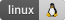
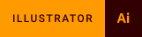

# Nenad Krstic
### Web Developer & Product Designer

Hello. My name is Nenad, creative problem solver. Through this document, I will take you through my experience in the IT industry spanning almost a decade.

    

With experience and skills gained through application development, I have also been involved in mentoring newbies. Mentoring four individuals, three of whom are working as successful developers while the fourth is on the way to becoming one, I further developed and improved skills in effective communication, project management, organization and teamwork. Those skills helped me later when I became a team leader.

In the following, I will take you through my projects and the ways in which I do development and [design](design/). Below you can see which technologies and tools I use during development and design.

_I do not know everything, but there is nothing that I cannot find out._

##### Technologies
              

##### Familiar With
    

##### Databases
 

##### Git Tools
 

##### Project Management Tools
 

##### Design
  

_...and still learning_

#### Continue reading
[Here](./design/) you can find out about design projects.