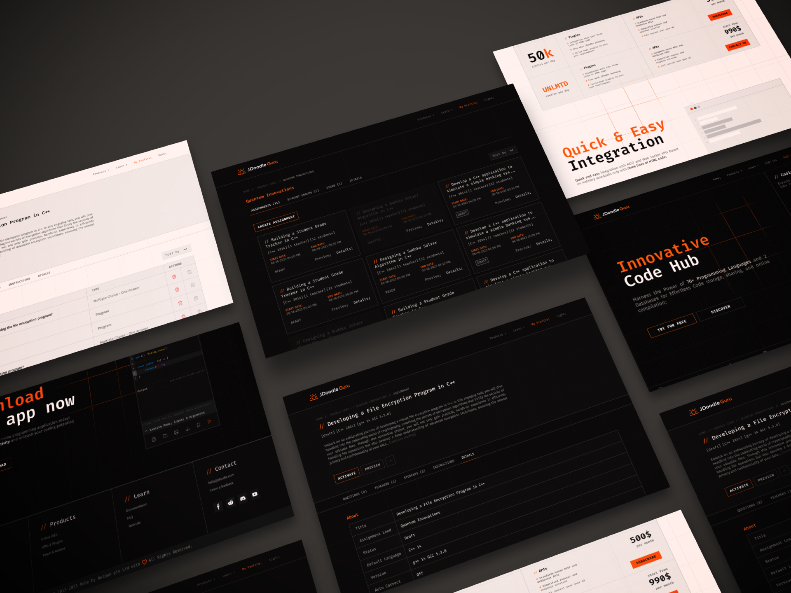

# Code Hub
      

### Files
- [Figma file](https://www.figma.com/file/uhnHH9JrapiHHumEVmf2SE/JDoodle-Design-Mastermind-Quest?type=design&node-id=1%3A1623&mode=design&t=FMJDqB8ICQzIvsRI-1)
- [Presentation file](https://www.figma.com/file/4d6ruA4wEPMAuA0odqWNyg/JDoodle-Design---Presentation?type=design&node-id=0%3A1&mode=design&t=zTN7eDABvb6NyqjL-1)
- [Presentation](https://www.figma.com/proto/4d6ruA4wEPMAuA0odqWNyg/JDoodle-Design---Presentation?type=design&node-id=1-279&viewport=0%2C0%2C1&t=zTN7eDABvb6NyqjL-0&scaling=min-zoom&page-id=0%3A1&starting-point-node-id=1%3A279)

### Description
A project that was made for a contest on Freelancer. It was necessary to come up with a modern product design, with a dark and light theme, for the Code Hub adhering to their brand colors and logo. You can read more about the project and the approach I took [here](https://www.figma.com/proto/4d6ruA4wEPMAuA0odqWNyg/JDoodle-Design---Presentation?type=design&node-id=1-279&viewport=0%2C0%2C1&t=zTN7eDABvb6NyqjL-0&scaling=min-zoom&page-id=0%3A1&starting-point-node-id=1%3A279).

### Images

#### Home Page

#### Assignments Page

#### Assignment Questions

#### Assignment Details

#### Code Hub

#### Integrate Page

