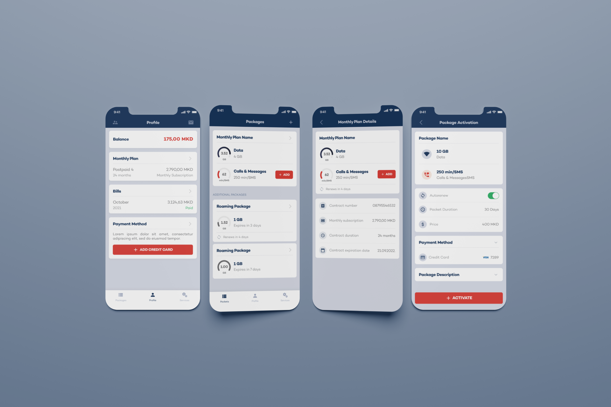

# Self Care

      

### Files
- [Figma file](https://www.figma.com/file/oTHmDJGd9bbUpH1dnH0Rp2/Telecom-Self-Care?type=design&node-id=0%3A1&mode=design&t=oWhjLyBaXLIhWGxH-1)

### Description
For users of mobile operator services, it was necessary to develop an application for self-care that would make it easier for users to keep records of subscriptions and internet usage, calls and messages. As with the [chat application](../chat/README.md), I led the development of the UX/UI design from the initial research stage to developer support.

### Images

