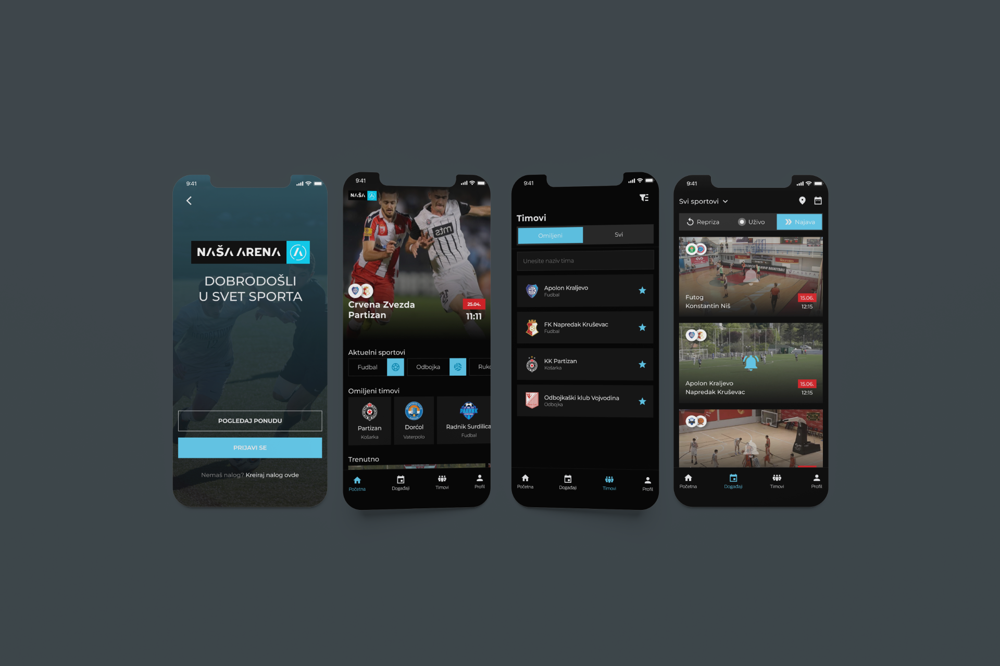

# Streaming Sports
      

### Files
- [Figma file](https://www.figma.com/file/VUj9vcBZcUtvlIUJiFJQ9q/Streaming-Sports-Application?type=design&node-id=647%3A335&mode=design&t=2NZULuX5XEZhNqj1-1)
- [Instructions](./Instructions.pdf) _The instructions are written in Serbian language at the client's request._

### Description
Application for streaming minor league sports events. As in previous projects, the task I had was to develop the user interface and user experience based on the client's brief. The application used the [Pixellot](https://www.pixellot.tv/) solution, automated recording with AI cameras.

### Images

